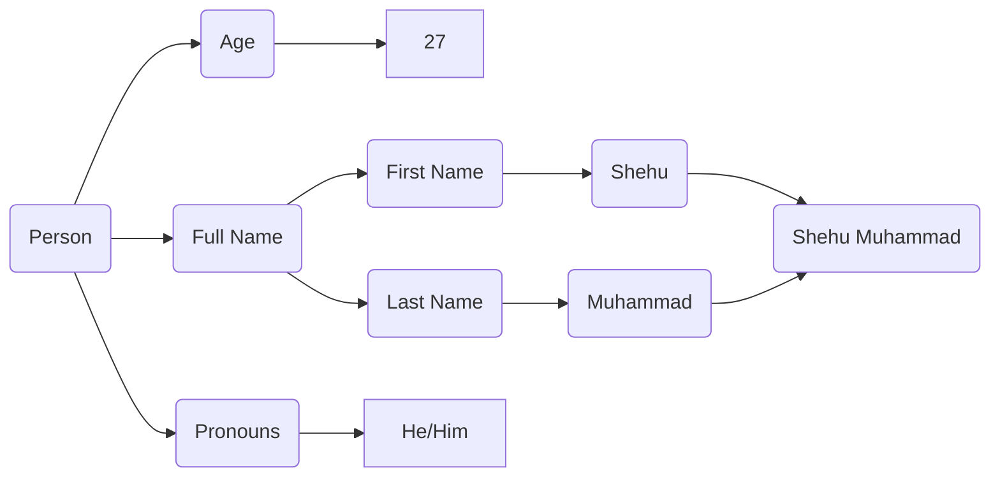
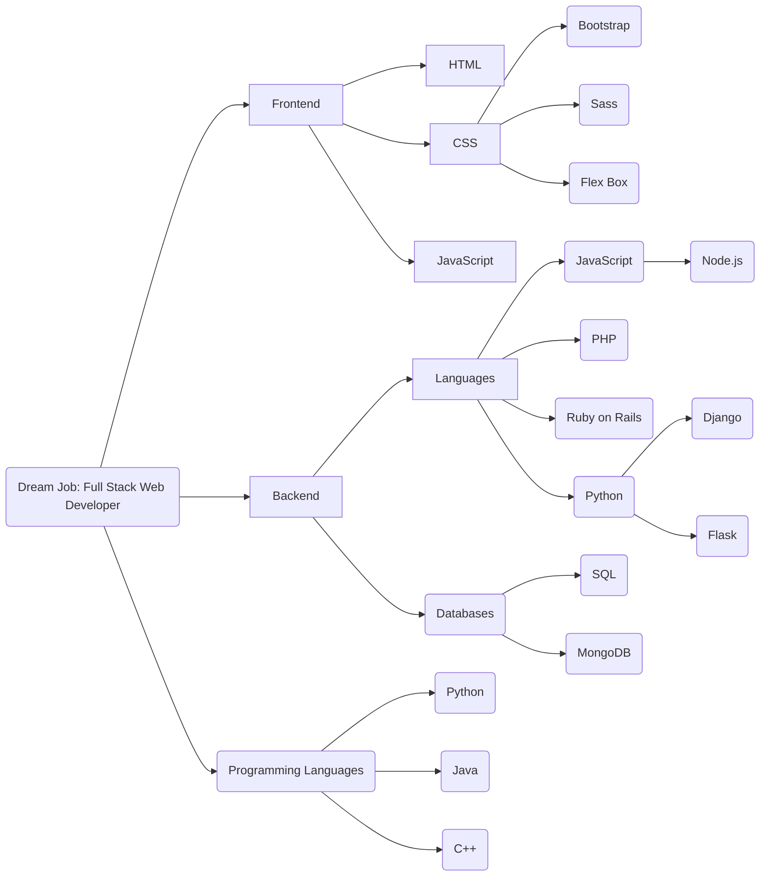

# Who am I?
## Basic Information

## Career Goal

## Hobbies
- Playing Video Games
##### Favorite 3 Games of All Time
&nbsp;&nbsp;1. Bloodborne
&nbsp;&nbsp;2. Sekiro
&nbsp;&nbsp;3. Elden Ring
- Watching Movies
- Working on websites
- Learn new coding languages
* C++ :no_mouth:
* PHP :tired_face:
* React Framework :fearful:
- eating snacks
## Favorite Foods
1. Tacos :yum:
2. Chicken ==BBQ Grilled Baked== :yum:
3. Spaghetti
4. Pasta
5. Pizza :yum:
6. ~~String Beans~~
7. ~~mushrooms~~
8. ~~other nasty stuff~~
## Favorite Fruit
- oranges
- ==green== apples
- watermelon
- grapes
- pineapples
- ~~prunes~~
- peaches
- plums
:joy: :joy: :joy: :smile: :smile: :smile: :relieved: :relieved: :relieved:

